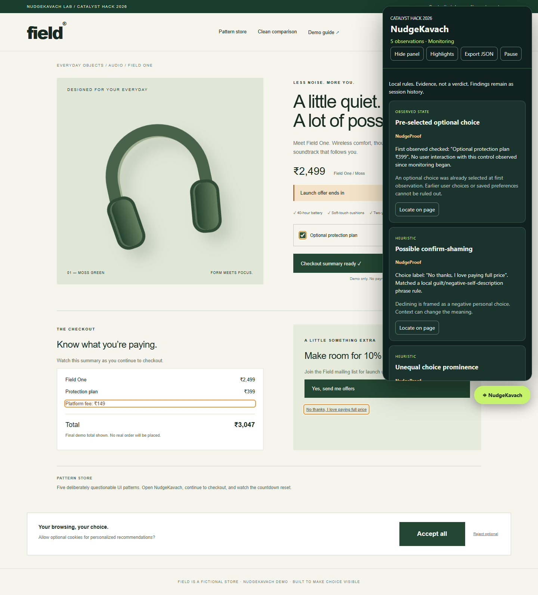

# NudgeKavach

**See the Manipulation Before You Click.**

Catalyst Hack 2026 · Cybersecurity & Digital Trust · MVP v0.1

NudgeKavach is a Chrome Manifest V3 extension that turns local page observations into **NudgeProof** evidence cards. The project includes a controlled e-commerce frontend, a local Node server, five deterministic detectors, and a clean comparison store.

No API key, account, remote AI, database, analytics, or runtime npm dependencies are needed. The backend serves the demo; the extension performs all detection locally.



## Quick start

Requires Node.js 22+ and Chrome (or Chromium with extension support).

```sh
git clone https://github.com/kartikvermagit-ds/NudgeKavach.git
cd NudgeKavach
npm start
```

1. Open **http://127.0.0.1:4173/** in Chrome.
2. Open `chrome://extensions`, enable **Developer mode**, and choose **Load unpacked**.
3. Select the repository's **extension/** folder containing `manifest.json`.
4. Reload the store, then click the green **NudgeKavach** launcher.
5. Click **Continue to checkout** and keep the tab visible for about **15 seconds**. All five findings should appear.

On Windows, `start-demo.cmd` also starts the server. Keep the terminal open; Ctrl+C stops it. Set `PORT` if 4173 is busy. Existing `/demo/` URLs redirect to the new frontend root and preserve their query strings.

The extension automatically monitors local HTTP pages. On another regular HTTP/HTTPS site, click its toolbar icon and **Scan this page**. Chrome internal pages and other protected pages cannot be scanned; the popup reports the error.

## Repository structure

```text
NudgeKavach/
├── frontend/                  # Fictional Field store and presenter guide
│   ├── index.html
│   ├── guide.html
│   ├── store.css
│   └── store.js
├── backend/
│   └── server.cjs             # Loopback-only static host and GET /health
├── extension/                 # Load this folder unpacked in Chrome
│   ├── manifest.json
│   ├── rules.js               # Pure deterministic rules
│   ├── content.js             # DOM observation, evidence, panel, highlights
│   └── popup.*                # Toolbar activation
├── tests/
│   ├── unit/                  # Rule and local-server tests
│   ├── integration/           # Actual MV3 browser integration test
│   └── fixtures/              # Curated example NudgeProof report
├── docs/                      # Detector details, demo script, roadmap, QA
│   └── assets/                # Curated demo screenshot
├── scripts/check.cjs          # Syntax and extension-entry checks
├── .github/workflows/ci.yml    # Automated verification on push/PR
├── design.md
├── architecture.md
├── CONTRIBUTING.md
├── SECURITY.md
├── CHANGELOG.md
├── package.json
└── package-lock.json
```

Frontend code, server code and extension code have separate responsibilities. The extension remains a self-contained installable folder: its popup and on-page panel are part of the browser extension, not the demo website.

## Five detectors

| Pattern                          | NudgeProof observation                                                                         |
| -------------------------------- | ---------------------------------------------------------------------------------------------- |
| Pre-checked optional add-on      | A visible optional checkbox was checked when first observed, without observed user interaction |
| Unequal Accept/Reject prominence | Accept area is at least 2.5× Reject, or its font at least 1.5×                                 |
| Suspicious countdown reset       | A timer increased by more than 2 seconds after at least two descending samples                 |
| Late-visible fee                 | A fee with monetary text appeared after the initial visible fee baseline                       |
| Confirm-shaming                  | A choice label matched a local guilt or negative-self-description phrase rule                  |

Each finding includes evidence, explanation, first-seen time and an evidence category. Categories describe the kind of evidence; they are not probability scores. A suspicious timer reset does not by itself prove an offer is fake. A later fee may be a legitimate recalculation.

Open **Clean comparison** for equal cookie buttons, an unchecked optional add-on, neutral refusal, an upfront fee, and a timer that expires without restarting. Expect zero findings, including after selecting the add-on yourself.

## Panel and timeline

- **Locate on page** scrolls to the source element; amber outlines show observations.
- **Export JSON** downloads the evidence report and timeline.
- **Pause / Resume** controls collection; events during a pause are unknown.
- **Hide panel** closes the UI while monitoring continues.
- **Highlights** toggles the overlays.

Findings remain as session history even if a checkbox changes or a cookie banner disappears. Reload to clear the session and establish a new baseline. A route change inside one document keeps the previous baseline and is recorded in the timeline.

## Development and verification

Running the demo does not require `npm install`. Install development dependencies when running browser tests:

```sh
npm ci
npm run format:check
npm run check
npm test
npx playwright install chromium
npm run test:browser
```

`npm run dev` restarts the server when its source changes. Frontend files are served without caching; refresh the browser after editing them. For extension changes, click **Reload** on `chrome://extensions`, then refresh the store.

Use `npm run format` to apply the shared formatting rules. Frontend, backend, extension and documentation sources are kept readable with a pinned formatter.

Browser tests start the actual backend on an OS-assigned free port and load the actual MV3 extension into a temporary Chromium profile. They verify all five patterns, clean controls, dynamic elements, timeline, pause/resume, report download, popup errors and Chrome messaging. Generated screenshots and reports go under ignored **test-results/**. They do not overwrite curated documentation assets or fixtures.

The popup test substitutes active-tab selection because an automated popup tab is itself active. Real scripting and messaging still execute against the local demo. A real toolbar click granting access on an unrelated website remains a manual smoke check.

GitHub Actions runs syntax, unit and browser checks on pushes and pull requests. See [verification details](docs/test-results.md) for local results and scope.

## Documentation

| Document                                | Purpose                                                        |
| --------------------------------------- | -------------------------------------------------------------- |
| [Design](design.md)                     | Visual language, UI behavior and evidence presentation         |
| [Architecture](architecture.md)         | Components, observation flow, boundaries and decisions         |
| [Detector reference](docs/detectors.md) | Rules, thresholds, evidence and false-positive limits          |
| [Demo script](docs/demo-script.md)      | Hackathon walkthrough and recovery steps                       |
| [Roadmap](docs/roadmap.md)              | Follow-up work, explicitly separated from implemented features |
| [Contributing](CONTRIBUTING.md)         | Setup, checks and contribution workflow                        |
| [Security](SECURITY.md)                 | Privacy model, permissions, report handling and scope          |
| [Changelog](CHANGELOG.md)               | MVP changes                                                    |

## Scope and privacy

The extension sends no page data over the network. Evidence lives in tab memory; JSON export is user-triggered and omits query strings and fragments. Text snippets can contain page content, so review an export before sharing it. The backend exposes only the frontend and a health route; it does not collect reports or create real orders.

This MVP scans the top-level DOM, native checkboxes, English phrases, currency fee text on leaf elements, and textual countdowns. It does not inspect iframes, shadow DOM, images/canvas, cross-page checkouts or previous visits. Geometry is only one aspect of visual prominence. Large pages, background throttling and rapid changes can reduce coverage. A clean result is not a guarantee.

AI is intentionally omitted. Any future optional classifier must preserve deterministic observations and obtain consent before transmitting page text.

## Originality and licensing

All project code and CSS illustrations were created for this MVP. No external repository code or image assets were copied. Chrome platform behavior was checked against official [activeTab](https://developer.chrome.com/docs/extensions/develop/concepts/activeTab) and [scripting](https://developer.chrome.com/docs/extensions/reference/api/scripting) documentation. Development-only Playwright retains its own license. A project license has not been selected; public repository visibility alone does not grant an open-source license.
