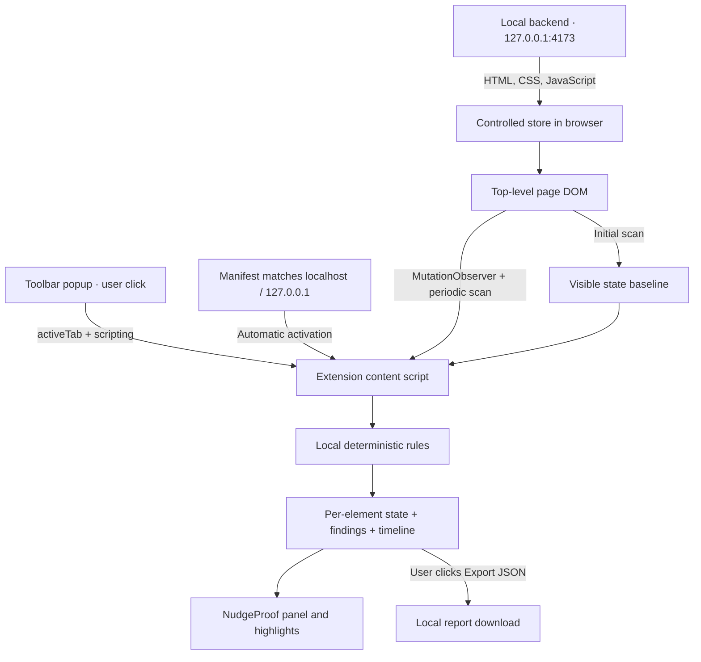

# NudgeKavach architecture

The MVP has three runtime boundaries: a static demo frontend, a local Node.js backend that serves it, and a Chrome Manifest V3 extension that performs detection in the browser. The backend does not receive scan results or run classifiers.

## Repository map

```text
frontend/                  Controlled Field store and HTML presenter guide
backend/server.cjs         Local static server and health endpoint
extension/                 Installable Chrome Manifest V3 extension
  manifest.json            Permissions and content-script entry points
  rules.js                 Pure deterministic matching and thresholds
  content.js               DOM observations, state, evidence and on-page UI
  popup.*                  User-initiated activation and status UI
tests/
  unit/                    Node rule and server tests
  integration/browser.cjs  Tests with the actual unpacked extension
  fixtures/                Example NudgeProof report
docs/                      Detector details, demo script and roadmap
docs/assets/               Committed documentation images
test-results/              Generated browser artifacts; ignored by Git
```

## Data flow



There is no scan-to-server connection, external AI call, database, account system or analytics service. `GET /health` is a local readiness endpoint, not a report-ingestion API.

## Backend and frontend

`npm start` starts `backend/server.cjs` on the loopback interface. The default port is 4173; `PORT` selects a different port. The static root is `frontend/`. `/` serves the store, `/guide.html` serves its guide, and legacy `/demo` routes redirect to their new equivalents. `GET /health` returns JSON for local readiness checks.

The frontend uses browser-native HTML, CSS and JavaScript. Query parameter `mode=clean` selects the comparison fixture. Store state is ephemeral: the add-on changes the displayed total, checkout reveals the controlled late fee, and the pattern countdown restarts. No payment or subscription is submitted.

The server accepts GET and HEAD requests and serves frontend files only; it does not expose the extension, repository metadata or documentation as static files. Its exported `createServer` factory allows tests to start an isolated instance on an available local port.

The server is a development/demo host. Production hosting, authentication and business services are outside this release. The extension can inspect a supported page independently of this server once activated.

## Extension activation and permissions

- Manifest content scripts load `rules.js` before `content.js` on local HTTP pages at `document_start`; scanning waits for the document body.
- The popup requests the active tab and injects the same two scripts through `chrome.scripting`, then sends `NK_OPEN` to open the panel.
- A global initialization guard reuses the scanner after repeated injection. It preserves the current document's observations.
- `activeTab` and `scripting` support user-initiated scans. Persistent host access is limited to `http://localhost/*` and `http://127.0.0.1/*`.
- The manifest has no background service worker, storage permission, cookies permission or browsing-history permission.

Chrome-protected pages cannot be scanned. The popup reports activation errors instead of claiming success.

## Observation lifecycle

1. Create the isolated panel and perform the first scan of visible top-level DOM elements.
2. Record the first visible fee baseline and first-seen state for eligible checkboxes; begin per-element timer histories.
3. Observe child, text and selected attribute mutations. Debounce triggered scans by 180ms.
4. Scan every second as a fallback for property-only changes and layout changes. Mutation-triggered scans may run between periodic scans.
5. Apply pure rules to extracted text and geometry, then deduplicate findings by detector type and element identity.
6. Update retained evidence, the timeline, cards and highlight overlays.

Trusted pointer and keyboard interactions with checkboxes or their labels are tracked to avoid treating an observed user selection as an unseen default. The checkbox rule inspects each eligible element at first visible observation; it is not a complete audit of every subsequent change to that control.

Visibility here means an element has layout dimensions and is not hidden by the checked DOM/CSS conditions. It does not prove that the user looked at the element or that another element did not cover it. Elements below the viewport can be scanned; outlines are drawn for visible viewport positions.

## State and NudgeProof model

State lives in the content script's memory for one document. `WeakMap`/`WeakSet` structures track element IDs, timer history and interaction history. A `Map` retains findings, a set retains the initial fee text signatures, and an array retains timeline events.

| Export field                | Meaning                                                                                   |
| --------------------------- | ----------------------------------------------------------------------------------------- |
| `product`, `version`        | Report producer and MVP version                                                           |
| `page`                      | Origin and pathname; query and fragment are omitted                                       |
| `started`                   | Monitoring start timestamp                                                                |
| `monitoring`                | Whether collection was enabled when exported                                              |
| `findings[]`                | Type, title, evidence strings, interpretation, evidence category and first-seen timestamp |
| `findings[].elementPresent` | Whether the original element remained attached at export                                  |
| `timeline[]`                | Timestamp, elapsed seconds and event message                                              |

The field `confidence` contains a category such as `Observed behavior`; it is not a calibrated probability. Element references remain in memory and are removed from export. No screenshot or full-page DOM snapshot is included.

Retention is bounded to 100 findings, 120 timeline events and eight evidence strings per finding. The first evidence string is retained as later evidence rolls over. Text snippets are normalized and capped at 240 characters. The UI shows the latest 30 timeline events.

## Rendering and trust boundaries

The panel lives in a closed shadow root to reduce collisions with page styles and to keep its own text out of ordinary scans. Captured text is rendered through `textContent`. Highlight rectangles use a separate overlay layer with pointer events disabled, so highlighting does not resize measured controls or prevent clicks.

A shadow root is UI isolation, not a security boundary against a hostile website. A page controls its own DOM and can obscure or remove the host element. Findings are observations, not cryptographic attestations.

## Session limitations

Reloading clears all state. SPA URL changes are logged but retain the document's original baseline. Pausing keeps prior state; activity during the pause is unknown. The scanner does not inspect iframes, shadow DOM contents, canvas text or cross-page checkout histories. Timer observations are tied to the same element, so replacing the timer element begins a new history.

The broad top-level scans suit small demonstration pages. Large or rapidly changing pages, background-tab throttling and short-lived DOM changes may skip evidence or increase work. See [detector details](docs/detectors.md) for rule-specific limits and [roadmap](docs/roadmap.md) for proposed improvements.

## Validation boundary

`npm run check` checks JavaScript syntax. `npm test` exercises pure rules and local server behavior. `npm run test:browser` starts a separate instance of the same server on an available local port, loads the real unpacked MV3 extension in a disposable Chromium profile and checks the controlled fixtures, evidence, export and popup path. It writes generated artifacts to ignored `test-results/`. The popup test substitutes active-tab selection because the automation opens the popup as a tab; injection and messaging still use extension APIs.

`.github/workflows/ci.yml` runs dependency installation, syntax checks, unit tests and Playwright browser tests on Node.js 22. Committed sample evidence and images remain under `tests/fixtures/` and `docs/assets/` respectively.

These checks establish behavior for the covered fixtures. They do not establish detection accuracy across the web or replace a manual toolbar check in the Chrome installation used for the presentation.
