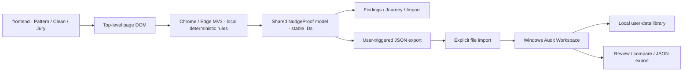

# NudgeKavach architecture

The browser observes; NudgeProof explains; Windows reviews. The web server only hosts a controlled demonstration. No scan data flows to a backend.

## Runtime boundaries

There is no browser-to-desktop live connection. A report import does not establish one. The desktop accurately displays **Not Connected**.

## Source ownership

- `frontend/`: native HTML/CSS/JS product site, controlled store, jury guide and account-free setup page.
- `backend/server.cjs`: GET/HEAD static serving and health endpoint. Default bind `0.0.0.0` supports the existing hosted demo; set `HOST=127.0.0.1` for loopback-only access. It cannot ingest reports.
- `extension/rules.js`: pure phrase, amount-marker, countdown and prominence threshold helpers.
- `extension/content.js`: extraction, per-element observation state, timeline, panel and source overlays.
- `extension/report.js`: browser-safe/Node-compatible shared report validator and presentation model. Kept inside the installable extension so it remains self-contained.
- `desktop/`: Electron main process, narrow preload bridge, local library and vanilla renderer.
- `tests/`: rule/server/contract/library tests and actual MV3/Electron integration.
- `scripts/build-desktop.cjs`: stages only desktop source and shared model/logo; produces an unsigned portable Windows x64 build.

## Browser activation and observation

Manifest V3 loads `rules.js`, `report.js`, then `content.js` on matching local pages at document start. The toolbar injects the same scripts after the user grants active-tab access. A global guard prevents duplicate monitors.

Permissions remain **activeTab**, **scripting** and host access only for localhost/127.0.0.1 HTTP pages. There is no history, cookie, storage, all-sites permission or background service worker. Browser-internal pages fail with a visible error.

When the body exists, the scanner records initial visible fees, checkbox first state and timer baselines. A MutationObserver debounces relevant changes by 180 ms; a one-second scan covers property-only changes. The panel's closed shadow tree is excluded. UI animations do not trigger detector scans.

A Map retains findings keyed by detector and element identity; WeakMaps/Sets track element/timer/interaction state. Trusted control interactions avoid treating an observed user check as an unseen default. Rule thresholds and first-observation semantics are preserved. Remote changes that added basic ARIA controls, more currency markers and direct opacity measurement are retained.

Findings are capped at 100, timeline at 120 events, evidence at eight entries per finding. Extracted snippets are capped at 240 characters; composed evidence sentences can be longer. The first evidence remains while subsequent snippets roll over. A route change retains the document baseline and is logged; a reload starts a new session. Paused activity is unknown.

## Shared NudgeProof contract

`normalize(raw)` validates known report shapes and constructs a bounded safe object. Version 2 is additive: original evidence, interpretation, firstSeen, confidence and timeline survive. It adds sessionId, findingId, evidenceCategory, rule, before/after and limitation. The historical `confidence` property remains a category, never a probability.

IDs originate in the browser and survive import, sorting and export. New sessions use random identifiers; legacy IDs are deterministic from the exported page/start time. Legacy timestamps are never replaced with import time. A before/after field is derived only from a recognized captured observation; otherwise it explicitly states that no transition was captured.

Timeline metadata links actual recorded events to findings. Legacy title/time matching only links unambiguous existing events. No extra checkout, click or timer tick is synthesized.

`impact(report)` derives covered signal counts and unambiguous charge labels. Currency groups stay separate. Bare dollar/yen symbols do not acquire an assumed country. Multiple prices, recurring/range wording and ambiguous grouping are omitted from exact totals. Duplicate identical labels within a detector type are counted once. Totals are sums of observed labels, not verified checkout totals or savings.

`summary(report)` creates selectable/copyable plain text with observations, rules and caveats. See [the contract reference](docs/nudgeproof.md).

## Desktop trust boundary

A single-instance lock permits one writer per local library. Opening the application again focuses the existing window, preventing independent stale snapshots from overwriting imported reports.

Electron was selected to avoid introducing a Rust/native build toolchain for this hackathon. The application uses the existing JavaScript model and no frontend framework migration.

The renderer is sandboxed with context isolation, Node integration disabled, web security enabled and a restrictive CSP. A private app protocol serves an exact allowlist of packaged files. Network requests, remote navigation, popups, webviews and permission requests are denied. Captured/imported content is rendered as text.

The preload exposes named load/import/export/copy/clear actions, not arbitrary file access, shell execution or raw IPC. Main-process handlers verify the sending main frame. Native file dialogs select paths; renderer callers cannot nominate a read/write path. Reports are validated in the main process before persistence.

The library stores up to 40 explicitly imported sessions / 20 MiB under Electron userData. Individual imports are capped at 1 MiB. Writes use a temporary file followed by rename. Corrupt persisted libraries are left untouched and reported rather than silently discarded. Settings provides a confirmed clear action. Reports are plain local JSON, not encrypted or cryptographically attested. The UI distinguishes imported-at timestamps from original observation times.

Overview statistics derive from the imported library and completed local exports, never invented browsing history. Comparison selections are explicitly user-labeled Pattern Mode/Clean Control because exported URLs deliberately omit queries. The app cannot infer clean mode from a query-free page URL. Comparison is descriptive, not statistical validation.

## UI and performance

The extension panel remains lightweight and independent of desktop availability. No native bridge, localhost daemon, framework or persistence is added to scanning. The panel keeps card nodes during updates to preserve keyboard focus. Source overlays use pointer-events:none and do not alter layout. Locate respects reduced motion.

Desktop's larger session, library and report views operate on exported snapshots. They cannot locate or change live page elements. Historical elementPresent refers to export time, not current browser connectivity.

## Validation and limitations

Unit tests exercise rules, static-server boundaries, bounded import validation, report roundtrips, money parsing and persistence. Browser tests load real MV3 scripts and verify all five fixtures, clean controls, source markers, journey, pause, popup injection and JSON download. Electron integration imports the browser-produced report into an isolated temporary library and checks the UI, persistence and export. Screenshots live in ignored test-results.

Controlled fixtures do not establish web-wide accuracy. The scanner misses unsupported languages, frames/shadow DOM, replaced timer histories, brief mutations and some occluded or transformed controls. Direct computed opacity does not account for ancestor opacity or effective contrast. No signed desktop distribution, extension store publication, independent security/accessibility audit or AI classification is included.
